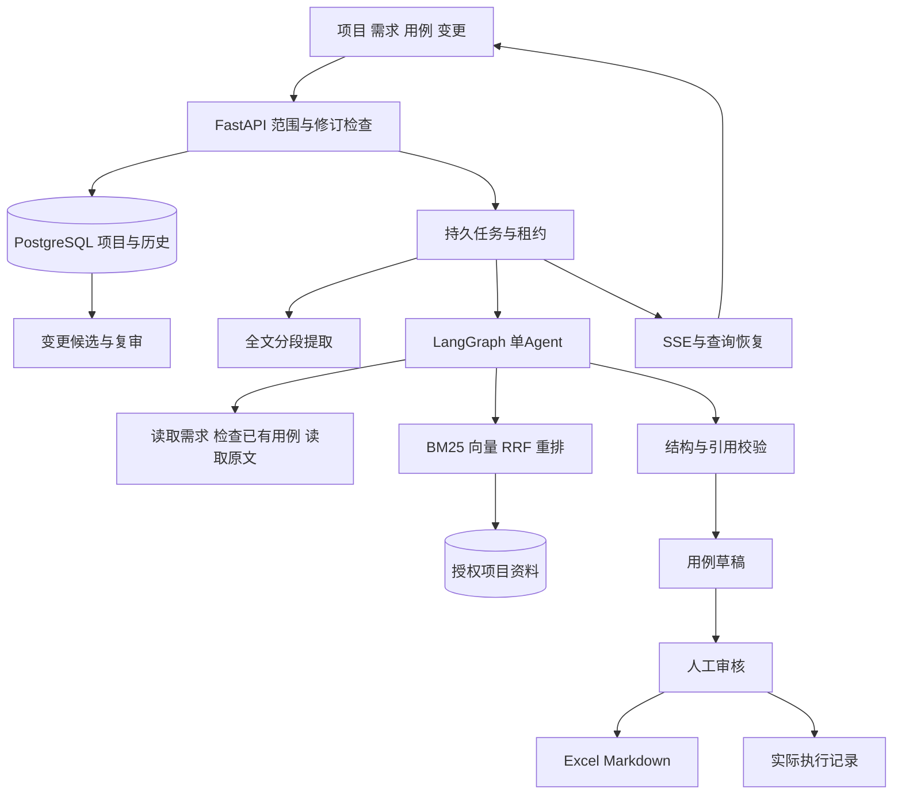

# CaseFlow 业务架构

```mermaid
flowchart TD
 UI[项目 需求 用例 变更] --> API[FastAPI 范围与修订检查]
 API --> DB[(PostgreSQL 项目与历史)]
 API --> Queue[持久任务与租约]
 Queue --> Extract[全文分段提取]
 Queue --> Agent[LangGraph 单Agent]
 Agent --> Tools[读取需求 检查已有用例 读取原文]
 Agent --> RAG[BM25 向量 RRF 重排]
 RAG --> KB[(授权项目资料)]
 Agent --> Validate[结构与引用校验]
 Validate --> Draft[用例草稿]
 Draft --> Review[人工审核]
 Review --> Export[Excel Markdown]
 Review --> Runs[实际执行记录]
 DB --> Changes[变更候选与复审]
 Queue --> Events[SSE与查询恢复]
 Events --> UI
```
